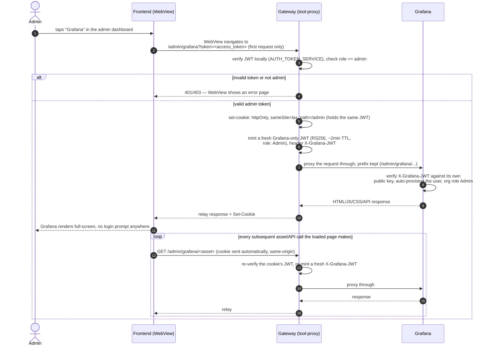

# Admin — Gated Grafana / Kafka UI Reverse Proxy

Neither Grafana nor Kafka UI is reachable on a published host port — the Gateway's own gate is the
*only* access control standing between a non-admin and either tool. Full design reasoning:
[docs/planning/02-admin-dashboard-plan.md](../planning/02-admin-dashboard-plan.md). This shows
Grafana; Kafka UI follows the identical shape (`/admin/kafka-ui` instead of `/admin/grafana`,
`KAFKA_UI_URL` instead of `GRAFANA_URL`).

A `WebView` navigation can't attach a custom `Authorization` header the way `fetch()` does — so the
existing Bearer-token model doesn't reach a route addressed by raw URL navigation. The fix: a
query-param token on the *first* request only, upgraded server-side to an httpOnly cookie that every
later request (including the proxied app's own asset/API calls) carries automatically.

Notes:
- **Stateless app-level cookie** — it holds the same JWT the query-param carried, re-verified on
  every request; no server-side session store to invalidate or leak.
- **Grafana JWT auth, not anonymous access** — every request past the Gateway's own gate is
  already a verified app-admin, so the Gateway mints a *second*, Grafana-scoped JWT (its own
  RS256 keypair, unrelated to the app's `JWT_SECRET`) asserting Grafana org role `Admin`, and
  Grafana verifies it itself rather than trusting the network path. See
  [../planning/05-grafana-jwt-auth.md](../planning/05-grafana-jwt-auth.md).
  `GF_SERVER_ROOT_URL`/`GF_SERVER_SERVE_FROM_SUB_PATH` make Grafana aware of the `/admin/grafana`
  mount prefix so its own asset/API links don't break.
- **The Grafana JWT never appears in a URL or log** — minted server-side, sent as a header on the
  proxied request only. Unlike the app-level cookie's known tradeoff below, this one has none.
- **Known, accepted tradeoff (app-level token only)**: the access token (≤15 min TTL) briefly
  appears in a URL/server log on that first navigation — consistent with this project's current
  dev-phase risk posture, not a production-grade pattern.
- **Full-screen `WebView`, never an embedded iframe** — avoids needing Grafana's
  `GF_SECURITY_ALLOW_EMBEDDING` at all, since nothing is framing anything.
