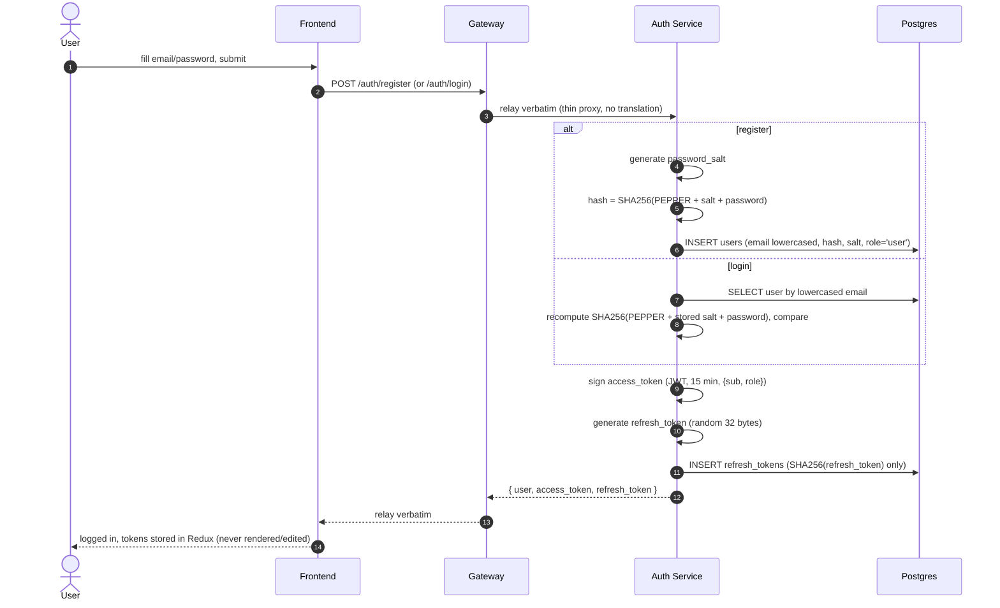
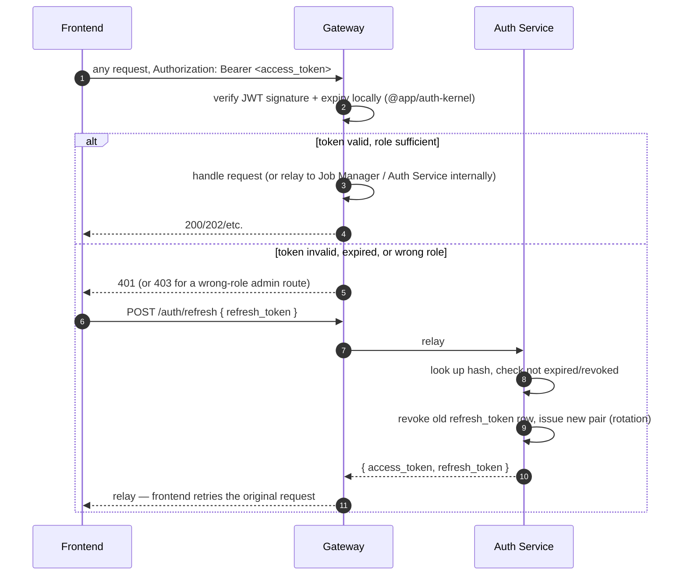

# Auth — Register, Login, Token Refresh, Per-Request Verification

Every route here is proxied through the Gateway — the frontend never calls Auth Service directly,
even though it still listens on its own port (`8001`) for that one server-to-server hop. See
[docs/specs/full-spec.md §8](../specs/full-spec.md) for the exact hashing formula and token TTLs.

## Register + login

## Every subsequent request — local verification, no Auth Service round-trip

Note: the Gateway's own `JwtAuthGuard`/`RolesGuard` reject an invalid token or insufficient role
**before** any call reaches Auth Service for an Auth-Service-bound route (`/me`, `/admin/users*`) —
Auth Service then re-verifies independently on its own side too (defense in depth, not redundant).
