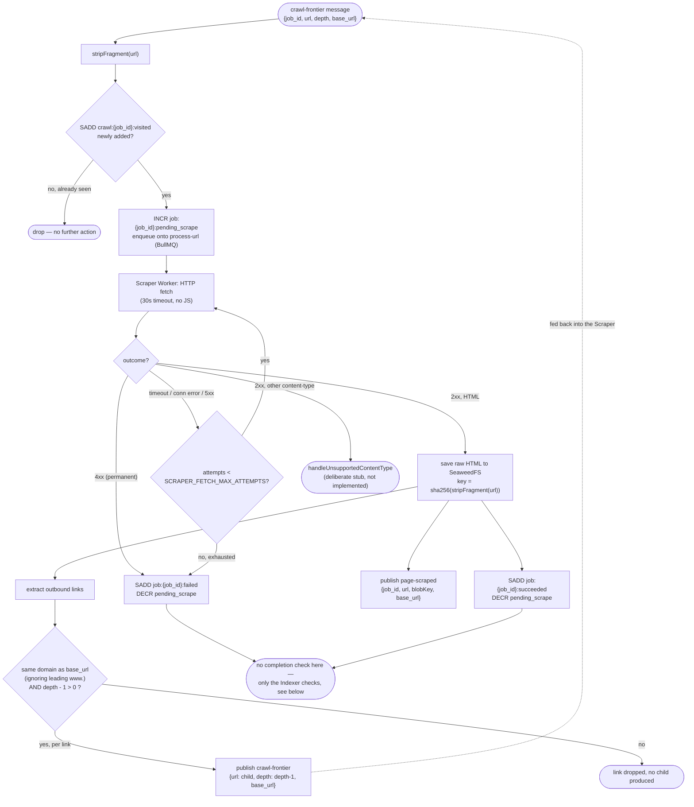
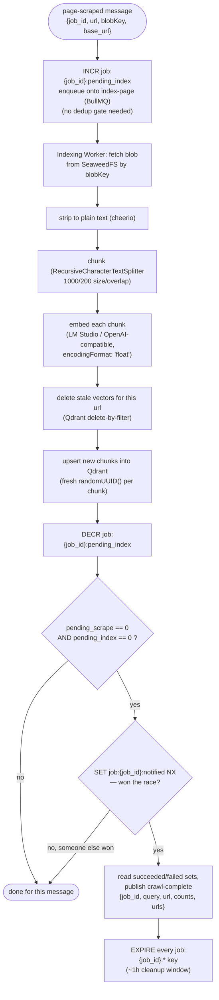

# Crawl + Index — Scraper/Indexer Internals

What actually happens inside the "crawl the site" and "index what it found" boxes of
[job-lifecycle-sequence.md](job-lifecycle-sequence.md) — the BFS frontier loop, the per-job dedup
gate, and the completion-detection race. Full mechanism:
[docs/planning/03-crawler-scraper-indexing-plan.md](../planning/03-crawler-scraper-indexing-plan.md).

## Scraper: one `crawl-frontier` message

## Indexer: one `page-scraped` message, and the completion race

**Why only the Indexer checks for completion**, never the Scraper: `page-scraped` delivery from the
Scraper to the Indexer is asynchronous. If the Scraper's own decrement also checked
`pending_index == 0`, a single-page job (no child links) could observe it as zero simply because
the Indexer hasn't incremented it yet — not because indexing actually finished — and fire
`crawl-complete` before the page is even queued for indexing. The job isn't done until it's
searchable, not merely scraped, so only the side that knows indexing is finished may declare
completion. The `SET NX` guard still matters even with one checker: at-least-once Kafka redelivery
of the same `page-scraped` message could otherwise decrement `pending_index` twice, letting two
worker calls both observe zero-zero for the same job.
