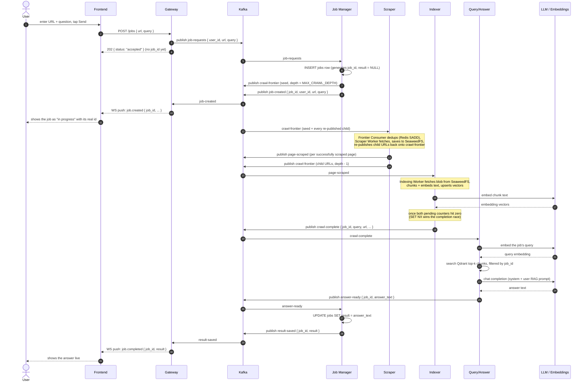

# Job Lifecycle — End to End

From "submit a URL + question" to "see the answer live," through every Kafka hop. Kafka is drawn as
one participant (the bus) since every hop below is publish/subscribe, not a direct call — that's
also why `POST /jobs` returns before a `job_id` even exists. See
[docs/specs/full-spec.md §6](../specs/full-spec.md) for the exact payload shape on every topic named
below, and [crawl-index-flowchart.md](crawl-index-flowchart.md) for what "crawl + scrape + index"
actually does in a loop (collapsed to one pass here for readability).

**On a failure anywhere in the answer step**: Query/Answer republishes `crawl-complete` itself with
`retry_count` incremented (a Kafka-native retry loop, capped backoff) instead of giving up
immediately; past `ANSWER_MAX_RETRIES` (or on a permanent error) it publishes `answer-ready` with
`failed_reason` set instead of `answer_text`, and everything downstream (`result-saved`,
`job.completed`) carries `failed_reason` instead. A user can then retry via `POST /jobs/:id/retry`,
which republishes `crawl-complete` directly — no re-crawl, Qdrant's chunks are reused as-is.
