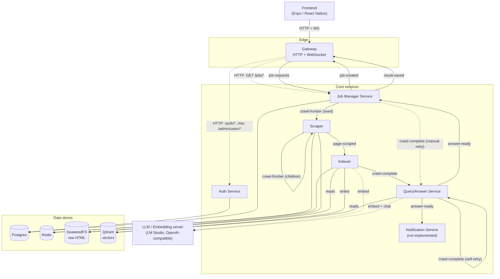

# System Architecture

Every service and data store, and what talks to what. Solid arrows are Kafka messages; dashed
arrows are synchronous HTTP calls. See [docs/specs/full-spec.md §3–4](../specs/full-spec.md) for
the prose version.

